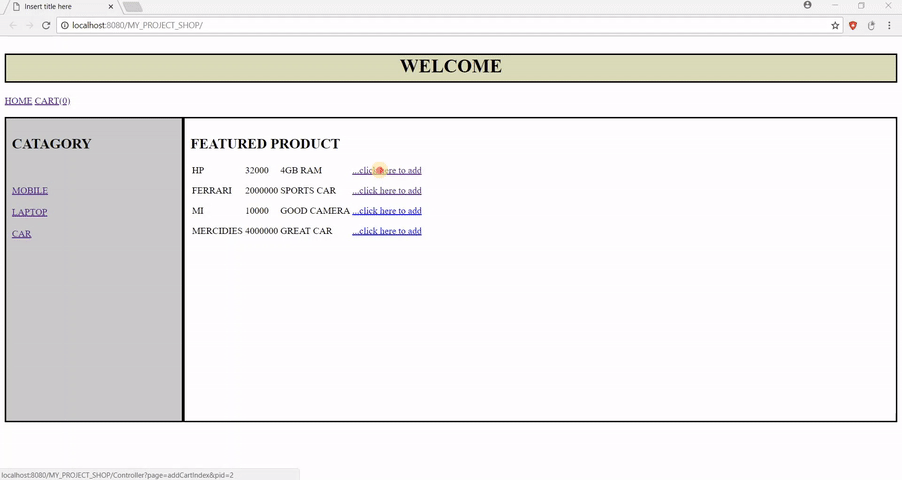

# Simple-CRM-System
This is an simple CRM system by using J2EE Technology

## Technologies 
* J2EE
* Css
* HTML
* Jsp
* Java
* MySql

## Tools
* Eclipse 
* Tomcat Server
* Dependency JAR fiels
* Phpmyadmin

## User Page

* All products are available to users 
* User can by or can add any product to there cart
* All User Have There individuals Credentials

## Admin Page

* All Product are available 
* Where admin can edit and add new product
